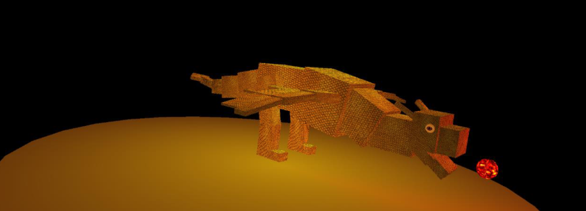

<div id="top"></div>

<!-- PROJECT LOGO -->
<br />
<div align="center">
  <h3 align="center">OpenGL Learning Project – Dragon</h3>
  <p align="center">
    <a href="#">View Demo (TODO)</a>
  </p>
</div>

<!-- TABLE OF CONTENTS -->
<details>
  <summary>Table of Contents</summary>
  <ol>
    <li><a href="#about-the-project">About The Project</a></li>
    <li><a href="#context">Context</a></li>
    <li><a href="#built-with">Built With</a></li>
    <li><a href="#documentation">Documentation</a></li>
    <li><a href="#getting-started">Getting Started</a></li>
    <li><a href="#usage">Usage</a></li>
    <li><a href="#contributors">Contributors</a></li>
  </ol>
</details>

<!-- ABOUT THE PROJECT -->
## About The Project

<div align="center">
  
</div>
<br />

This is a small project to learn the basics of OpenGL. The objective was to model a dragon with application of textures, animations, light management, and keyboard interactions.

<p align="right">(<a href="#top">back to top</a>)</p>

<!-- CONTEXT -->
## Context

This project is an academic project made during the **third year** of a **Bachelor** of Computer Science.  
The development was done by 2 people.

<p align="right">(<a href="#top">back to top</a>)</p>

<!-- BUILT WITH -->
## Built With

Entire project was built with C++ and [OpenGL](https://www.opengl.org/) and is only compatible with Linux.

<p align="right">(<a href="#top">back to top</a>)</p>

<!-- DOCUMENTATION -->
## Documentation

You can find documentation such as technical details, and instructions in the folder `docs`.  
Doxygen docs can be generated in HTML with script file `doxy/run_doxygen` ([Doxygen](https://doxygen.nl/) must be installed on your system).

<p align="right">(<a href="#top">back to top</a>)</p>

<!-- GETTING STARTED -->
## Getting Started

To get a local copy up and running follow the steps:

### Prerequisites

To compile the project, you will need:
* [Code::Blocks](https://www.codeblocks.org/)
* [OpenGL](https://www.opengl.org/)
* [Debian](https://www.debian.org/) (could also work with other distros)
```sh
apt-get install build-essential
apt-get install codeblocks
apt-get install libjpeg62-turbo-dev
apt-get install freeglut3-dev
apt-get install --reinstall libgl1-mesa-glx
```

Optional dependency:
```sh
apt-get install doxygen
```

### Installation

1. Clone the repo:
   ```sh
   git clone https://github.com/Akwd22/opengl-dragon.git
   ```
2. Open and compile the project with Code::Blocks IDE.

<p align="right">(<a href="#top">back to top</a>)</p>

<!-- USAGE EXAMPLES -->
## Usage

| Control          | Action              |
| ---------------- | ------------------- |
| <kbd>Z</kbd> / <kbd>z</kbd> / <kbd>Scroll up</kbd> / <kbd>Scroll down</kbd> | Zoom in/out |
| <kbd>Left click</kbd> + <kbd>Mouse move</kbd>   | Turn around the dragon    |
| <kbd>←</kbd>     | Rotate to the right          |
| <kbd>→</kbd>     | Rotate to the left           |
| <kbd>↑</kbd>     | Rotate downwards             |
| <kbd>↓</kbd>     | Rotate upwards               |
| <kbd>Space</kbd> | Play the fireball animation  |
| <kbd>p</kbd>     | Set plain mode               |
| <kbd>f</kbd>     | Set wireframe mode           |
| <kbd>s</kbd>     | Set the vertex only mode     |
| <kbd>d</kbd> / <kbd>D</kbd> | Toggle depth test |

<p align="right">(<a href="#top">back to top</a>)</p>

<!-- Contributors -->
## Contributors

This project was made by:
- [Eddy D.](https://github.com/Akwd22)
- [Clément G.](https://github.com/Zoreph22)

<p align="right">(<a href="#top">back to top</a>)</p>
